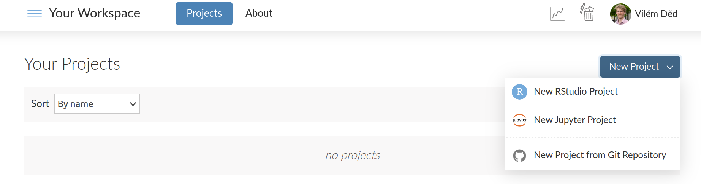
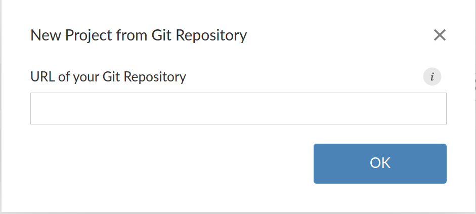
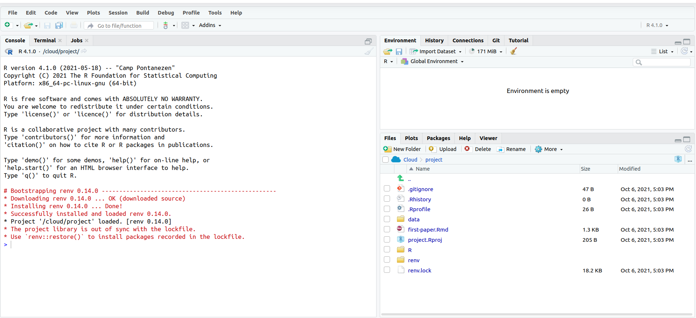
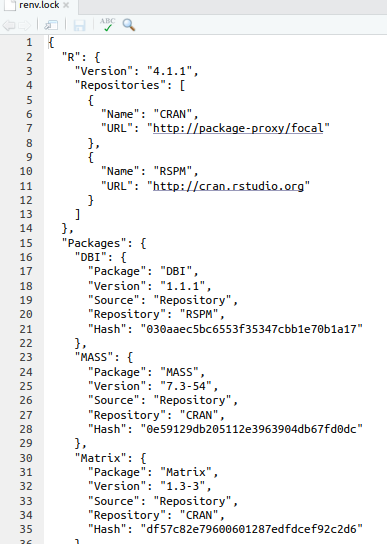
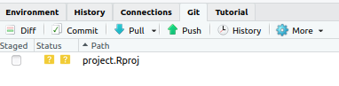
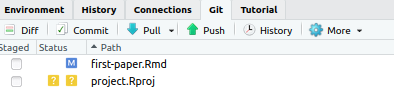
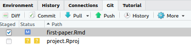
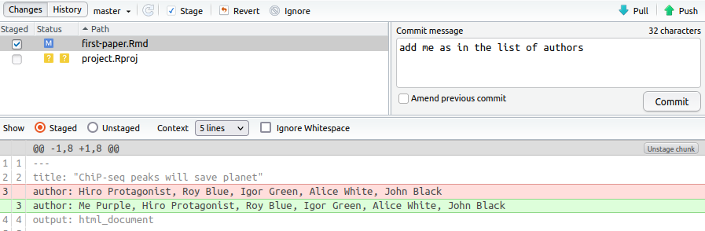
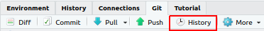

# Practical exercise on data analysis

In this practical, you will perform multiple steps needed on working environment setup for reproducible data analysis using the code versioning system `git`, systems environment management `renv` and `RMarkdown` to create reproducible documents.

## Requirements

* [Github](https://github.com) account
* [RStudio Cloud](https://rstudio.cloud) account

## Step 1: Create your R project

1. Login to the [RStudio Cloud](https://rstudio.cloud)
2. Select "New Project" -> "New Project form Git Repository"

    

3. Enter the URL of this repository (`https://github.com/elixir-luxembourg/project-setup-practical`) and hit OK

    

    After a while, you should see Rstudio IDE environment with your project.<br>
    

## Step 2: Restore your computational environment

1. Inspect the `renv.lock` file for the whole list of required packages. As you can see, it would be very laborious to install all those packages manually.

   

2. Install all packages by running command

   ```r
   renv::restore()
   ```

   in the **console** tab and confirm. Doing so ensures computational environment is always the same - for different users on different machines.

## Step 3: Git

1. Inspect the **Git** tab and see the list of changes.

   

2. Open the `first-paper.Rmd` file and update list of authors in the first section - add your name ;) - and save it.

    

3. File should appear in **Git** tab list. The blue icon means it was modified. Stage the changes for this file by checking the checkbox in `Stage` column.

    

4. Commit the change by clicking on `Commit`. You are prompted to review your changes. Add commit message and hit `commit`.

   

5. The file is no more listed in **Git** tab - naturally! All the changes of the file are commited.

   

6. Inspect history of the repository. Your commit should be the first. Inspect the metadata available for your commit - commit message, your name, date and commit hash (unique identifier).

At this moment, you might want to push your changes to the remote repository (Github) to make it available for others. This is not covered in this practical.

## Literate programming

1. Open the `first-paper.Rmd` file and hit `Knit`.

   

2. Review the resulting html file. Update the content of the RMarkdown document. You can add new code chunks, update the text or add new pieces of code available in `R/analysis-code.R` file.
3. Knit the document again.

## Final Assignement 
Download the generated `.html` file and sent it to the trainer.
